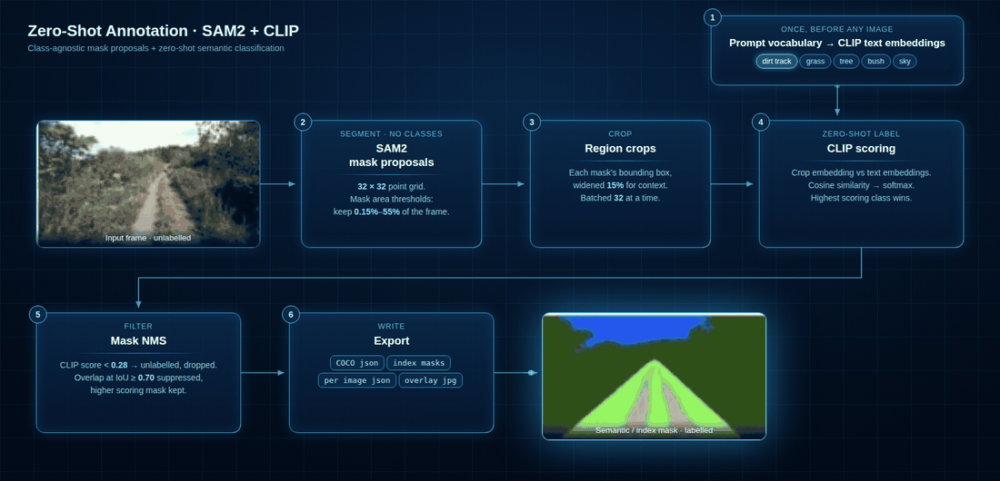

# Zero-Shot Annotation · SAM2 + CLIP

*Class-agnostic mask proposals + zero-shot semantic classification*

I built this to label object classes without training on them first. SAM2 finds the regions but never names them, so the semantic label comes from CLIP, driven by nothing more than a list of strings. Adding a class means adding a line of YAML rather than collecting and hand labelling a dataset.

The motivation was practical. Annotating off road and driving footage by hand is slow, and before anyone spends a week on it I wanted to know which classes a foundation model already handles in that domain, and where it falls apart once the scene stops looking like the internet.



*Every number in the figure is a default from `configs/`.*

## How it works

**1. Prompt vocabulary, once up front.** Each class goes through CLIP's text encoder under four templates and the results are averaged. This runs before any image is loaded, so the cost is paid once.

**2. SAM2 mask proposals.** The automatic mask generator samples a 32 × 32 point grid and returns class-agnostic masks. It has no idea what any of them are. Mask area thresholds keep regions between 0.15 and 55 percent of the frame, because above that band the mask is usually the sky and below it the mask is texture noise.

**3. Region crops.** Each surviving mask's bounding box is widened by 15 percent before cropping. A tight crop of a sign is ambiguous and a little context resolves it. Crops go out in batches of 32.

**4. CLIP scoring.** Crop embeddings are compared with the class text embeddings by cosine similarity, then softmaxed. The highest scoring class wins.

**5. Filtering.** Anything scoring under 0.28 becomes `unlabelled` and is dropped rather than forced into the nearest class. On an open vocabulary the model always returns something, and a confident wrong label costs more to fix than a gap. Mask NMS then suppresses masks overlapping at IoU 0.70 or higher, keeping the better scoring one, because SAM2 will happily return a tractor and its front wheel as separate proposals.

**6. Export** as COCO JSON, semantic index masks, per image JSON and an overlay JPG.

## Install

```bash
git clone https://github.com/shanmugaraja007/zero-shot-annotation.git
cd zero-shot-annotation
python -m venv .venv && source .venv/bin/activate    # Windows: .venv\Scripts\activate
pip install -r requirements.txt
pip install -e .
```

Weights come from Hugging Face on first run and are cached after that. It runs on CPU, though a GPU makes a large difference.

## Use

```bash
# one image, agricultural vocabulary
zsa examples/field.jpg -c configs/agriculture.yaml -o runs/field

# a directory, driving vocabulary, one COCO file for the whole run
zsa data/frames -c configs/driving.yaml -o runs/drive --coco

# override the vocabulary inline, no config edit
zsa image.jpg --prompts "combine harvester" "wheat stubble" "treeline" "sky"
```

Output layout:

```
runs/field/
  json/       per image annotations
  masks/      single channel index masks, 0 = background
  overlays/   tinted masks with labels, for checking by eye
  annotations_coco.json    (with --coco)
```

## As a library

```python
from zsa import PipelineConfig, ZeroShotAnnotator

cfg = PipelineConfig.load("configs/agriculture.yaml")
cfg.prompts = ["crop field", "tree", "dirt track", "sky"]

annotator = ZeroShotAnnotator(cfg)
for ann in annotator.annotate_image("field.jpg"):
    print(ann.label, round(ann.score, 3), ann.bbox)
```

## Configuration

| Key | What it does |
| --- | --- |
| `prompts` | The class vocabulary. This is the entire training step. |
| `templates` | Prompt templates each class is embedded under, then averaged. |
| `min_score` | Below this CLIP score a region is dropped rather than labelled. |
| `nms_iou` | Mask NMS threshold. Overlap at or above this discards the lower scoring mask. |
| `sam.points_per_side` | Side of the point grid, so 32 means a 32 × 32 grid. Higher finds small objects and costs time. |
| `sam.min_area_frac` / `sam.max_area_frac` | Mask area thresholds as a fraction of the frame. |
| `clip.context_pad` | Crop padding. A tight crop of a sign is ambiguous and context helps. |

Two vocabularies ship with the repo: `configs/agriculture.yaml` for off road and field scenes, and `configs/driving.yaml` for urban driving.

## On the score

`score` is a softmax over CLIP cosine similarities across the vocabulary. It says which class fits best relative to the others in the list, not how likely the label is to be correct. It shifts as soon as the vocabulary changes, so I treat `min_score` as a threshold to tune per domain rather than as a probability. Calling it a confidence would be misleading, which is why the field is named `score`.

## What this is not

This trades accuracy for coverage. It gives a usable first pass over a pile of unlabelled frames and shows which classes a foundation model already handles in a given domain. It does not replace a supervised model trained on real data, and the output still needs a human to check it, which is what the overlay export is for.

## Layout

```
src/zsa/
  config.py       dataclass config, YAML loading
  segmenter.py    SAM2 class-agnostic proposals, mask area thresholds
  classifier.py   CLIP text embeddings, prompt ensembling, crop scoring
  pipeline.py     orchestration, score floor, mask NMS
  export.py       COCO, JSON, index masks, overlays
  cli.py          command line entry point
configs/          agriculture and driving vocabularies
tests/            covers config, IoU, mask NMS and every export format
assets/src/       the animated pipeline figure and its render script
```

Tests run without downloading any weights:

```bash
pytest
```

## Licence

MIT
