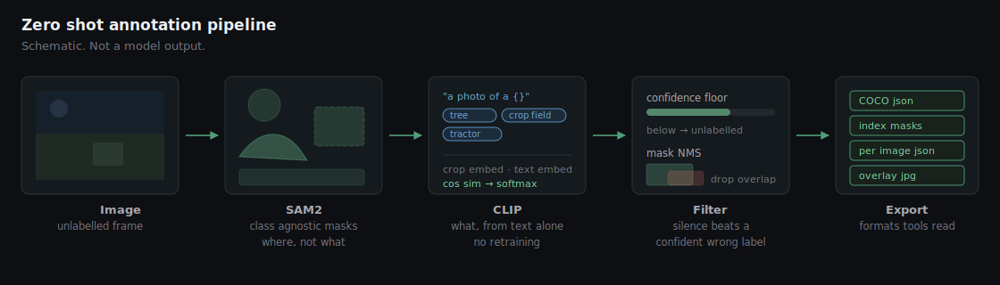

<<<<<<< HEAD
# Zero Shot Annotation -CLIP + SAM2
=======
# Zero Shot Annotation — CLIP + SAM2
>>>>>>> 44068ec (Add pipeline source, configs, assets and tests)

Label object classes you never trained on. SAM2 finds every region in an image without knowing what any of them are; CLIP names those regions using nothing but a list of strings you write. Adding a new class means adding a line to a YAML file, not collecting and hand labelling a dataset.

Built to cut manual annotation effort on off road and driving footage, and to see how far zero shot perception generalises when the scene stops looking like the internet.



*Schematic of the pipeline. Not a model output.*

## How it works

1. **SAM2** proposes class agnostic masks across the frame. Proposals outside a sane area band are dropped, since a mask covering 80 percent of the image is the sky, and one covering 0.05 percent is texture noise.
2. Each mask is cropped with a little surrounding context and **CLIP** scores it against the class vocabulary. Every class is embedded under several prompt templates and averaged, which buys accuracy for free because it runs once, before any image.
3. Anything below the confidence floor is written out as `unlabelled` rather than forced into the nearest class. On an open vocabulary the model will always return *something*, and a confident wrong label costs more to fix than a gap.
4. Overlapping masks are suppressed by IoU, keeping the higher scoring one. SAM2 will happily return a tractor and its front wheel as separate proposals.
5. Results are exported as COCO JSON, per image JSON, index masks, and a visual overlay for eyeballing.

## Install

```bash
git clone https://github.com/shanmugaraja007/zero-shot-annotation.git
cd zero-shot-annotation
python -m venv .venv && source .venv/bin/activate    # Windows: .venv\Scripts\activate
pip install -r requirements.txt
pip install -e .
```

Weights are pulled from Hugging Face on first run and cached. CPU works; a GPU is a lot happier.

## Use

```bash
# one image, agricultural vocabulary
zsa examples/field.jpg -c configs/agriculture.yaml -o runs/field

# a directory, driving vocabulary, single COCO file for the run
zsa data/frames -c configs/driving.yaml -o runs/drive --coco

# override the vocabulary inline, no config edit
zsa image.jpg --prompts "combine harvester" "wheat stubble" "treeline" "sky"
```

Output layout:

```
runs/field/
  json/       per image annotations
  masks/      single channel index masks, 0 = background
  overlays/   tinted masks with labels, for checking by eye
  annotations_coco.json    (with --coco)
```

## As a library

```python
from zsa import PipelineConfig, ZeroShotAnnotator

cfg = PipelineConfig.load("configs/agriculture.yaml")
cfg.prompts = ["crop field", "tree", "dirt track", "sky"]

annotator = ZeroShotAnnotator(cfg)
for ann in annotator.annotate_image("field.jpg"):
    print(ann.label, round(ann.confidence, 3), ann.bbox)
```

## Configuration

| Key | What it does |
| --- | --- |
| `prompts` | The class vocabulary. This is the entire training step. |
| `templates` | Prompt templates each class is embedded under, then averaged. |
| `min_confidence` | Below this a region is dropped rather than labelled. |
| `nms_iou` | Overlap above which the lower scoring mask is discarded. |
| `sam.points_per_side` | Proposal density. Higher finds small objects and costs time. |
| `sam.max_area_frac` | Upper area bound, kills whole frame masks. |
| `clip.context_pad` | Crop padding. A tight crop of a sign is ambiguous; context helps. |

## What it is not

This trades accuracy for coverage. It is a way to get a usable first pass over a pile of unlabelled frames, and to find out which classes a foundation model already handles in your domain before anyone spends a week annotating. It is not a replacement for a supervised model trained on your data, and the confidence scores are CLIP similarities, not calibrated probabilities.

## Layout

```
src/zsa/
  config.py       dataclass config, YAML loading
  segmenter.py    SAM2 proposals and geometric filtering
  classifier.py   CLIP prompt ensembling and crop scoring
  pipeline.py     orchestration, confidence floor, mask NMS
  export.py       COCO, JSON, index masks, overlays
  cli.py          command line entry point
configs/          agriculture and driving vocabularies
```

## Licence

MIT
